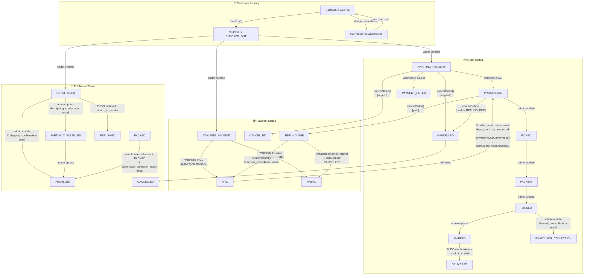
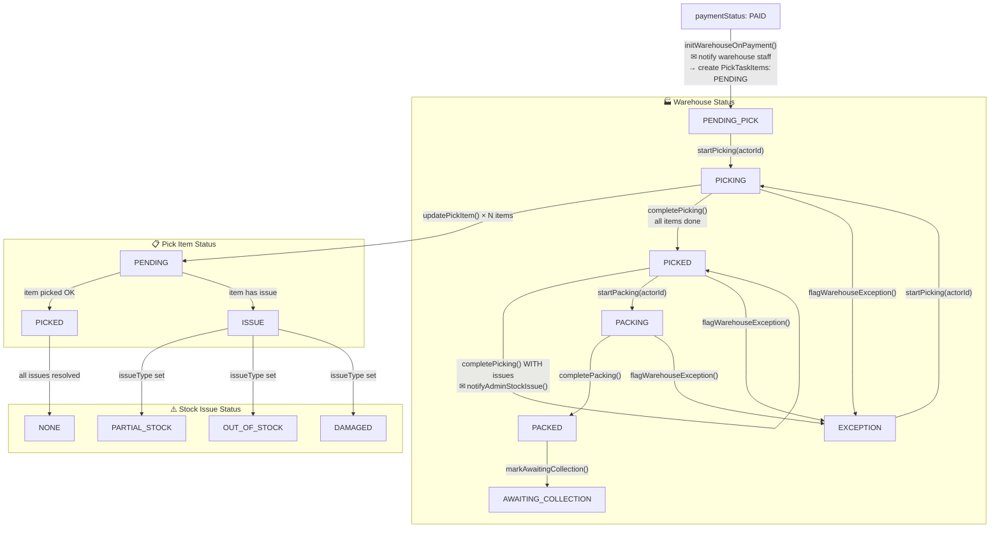
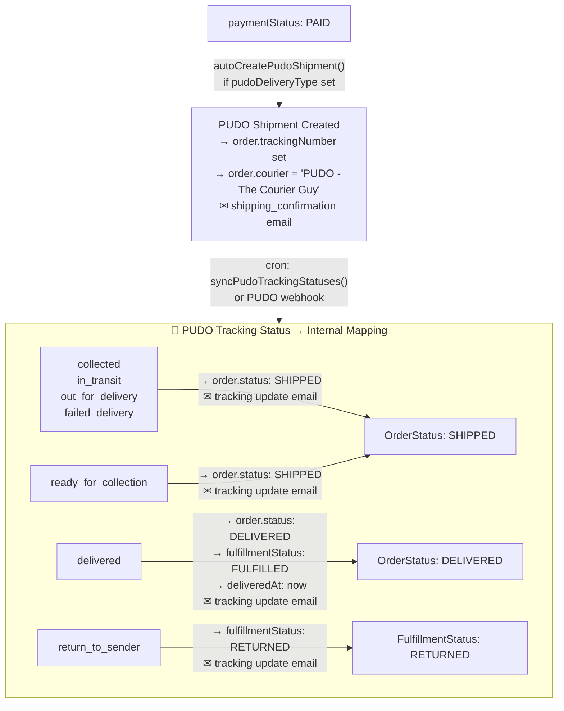
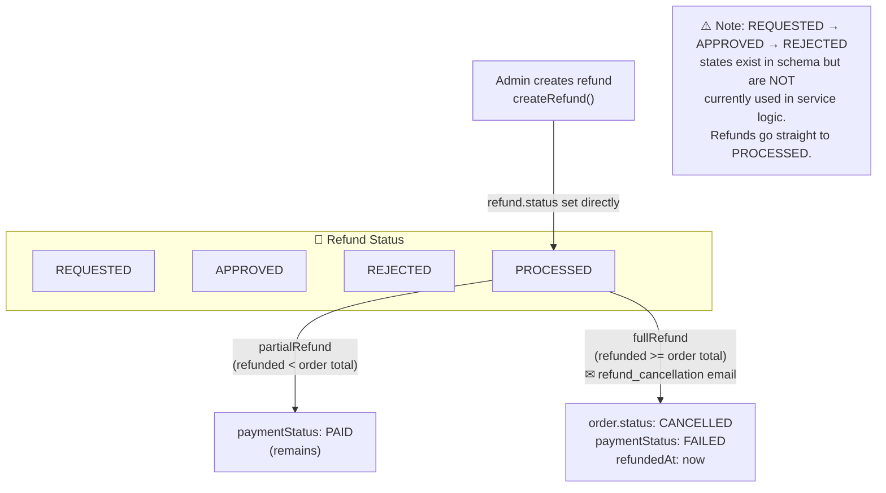
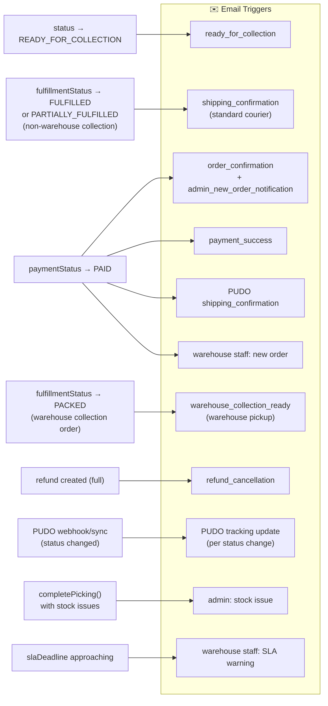

# Dear Body — Status Flow Diagrams

## 1. Order Lifecycle (status + paymentStatus + fulfillmentStatus)

---

## 2. Warehouse / Pick-Pack Flow (warehouseStatus)

---

## 3. PUDO Delivery Flow

---

## 4. Refund Flow

---

## 5. Email Triggers Summary

---

## Known Gaps / Potential Bugs

| Issue | Detail |
|---|---|
| **Refund states unused** | `REQUESTED`, `APPROVED`, `REJECTED` exist in schema but refunds go straight to `PROCESSED` — no approval workflow implemented |
| **PUDO shipment timing** | `autoCreatePudoShipment()` is called async and can silently fail — order status won't reflect failure |
| **Warehouse init async** | `initWarehouseOnPayment()` is also fire-and-forget — if it fails, `warehouseStatus` never gets set |
| **No guard on manual status updates** | Admin `updateOrderStatus()` / `updatePaymentStatus()` / `updateFulfillmentStatus()` accept arbitrary values with no valid-transition validation |
| **PUDO tracking vs fulfillmentStatus** | PUDO sync sets `order.status = SHIPPED` but doesn't always update `fulfillmentStatus` — they can drift |
| **ready_for_collection PUDO → SHIPPED** | PUDO `ready_for_collection` maps to `OrderStatus: SHIPPED` which is misleading for locker pickup orders |
